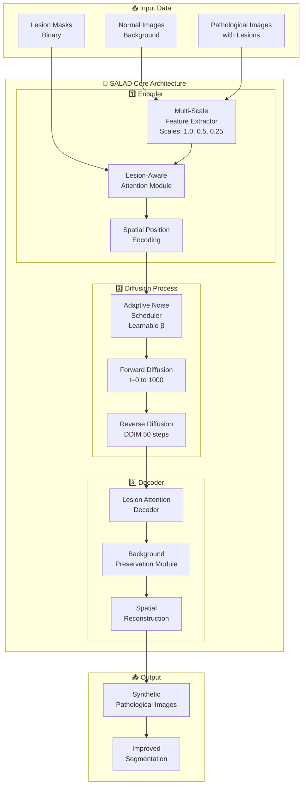

# 🏗️ SALAD Architecture & Pipeline

## 📊 Complete Pipeline Overview



## 🔄 Detailed Training Pipeline

```
┌─────────────────────────────────────────────────────────────┐
│                     SALAD Training Pipeline                  │
├─────────────────────────────────────────────────────────────┤
│                                                              │
│  1. DATA PREPARATION                                        │
│  ┌──────────┐  ┌──────────┐  ┌──────────┐                 │
│  │  Normal  │  │Pathology │  │  Lesion  │                 │
│  │  Images  │  │  Images  │  │   Masks  │                 │
│  └────┬─────┘  └────┬─────┘  └────┬─────┘                 │
│       │             │              │                        │
│       └─────────┬───┴──────────────┘                       │
│                 ▼                                           │
│  2. FEATURE EXTRACTION                                      │
│  ┌──────────────────────────────────────┐                 │
│  │   Multi-Scale Feature Extractor      │                 │
│  │  ┌────────┐ ┌────────┐ ┌────────┐  │                 │
│  │  │Scale   │ │Scale   │ │Scale   │  │                 │
│  │  │1.0×    │ │0.5×    │ │0.25×   │  │                 │
│  │  └────────┘ └────────┘ └────────┘  │                 │
│  │         Concatenate Features         │                 │
│  └──────────────┬───────────────────────┘                 │
│                  ▼                                          │
│  3. SPATIALLY-AWARE ATTENTION                              │
│  ┌──────────────────────────────────────┐                 │
│  │    Lesion-Aware Attention Module     │                 │
│  │  ┌─────────────────────────────┐    │                 │
│  │  │   Q = W_q(Features)         │    │                 │
│  │  │   K = W_k(Features + Mask)  │    │                 │
│  │  │   V = W_v(Features + Mask)  │    │                 │
│  │  │   Attention = Softmax(QK^T)V│    │                 │
│  │  └─────────────────────────────┘    │                 │
│  └──────────────┬───────────────────────┘                 │
│                  ▼                                          │
│  4. ADAPTIVE NOISE SCHEDULING                              │
│  ┌──────────────────────────────────────┐                 │
│  │      Adaptive Noise Scheduler        │                 │
│  │   β_t = β_base * (1 + 0.1σ(θ_t))    │                 │
│  │   α_t = 1 - β_t                      │                 │
│  │   ᾱ_t = Π(α_0...α_t)                │                 │
│  └──────────────┬───────────────────────┘                 │
│                  ▼                                          │
│  5. DIFFUSION PROCESS                                      │
│  ┌──────────────────────────────────────┐                 │
│  │         Forward Diffusion            │                 │
│  │   x_t = √ᾱ_t * x_0 + √(1-ᾱ_t) * ε  │                 │
│  │                                      │                 │
│  │         Reverse Process              │                 │
│  │   x_{t-1} = μ_θ(x_t, t) + σ_t * z  │                 │
│  └──────────────┬───────────────────────┘                 │
│                  ▼                                          │
│  6. BACKGROUND PRESERVATION                                │
│  ┌──────────────────────────────────────┐                 │
│  │    100% Background Preservation      │                 │
│  │   Output = Lesion * Mask +           │                 │
│  │           Background * (1 - Mask)    │                 │
│  └──────────────┬───────────────────────┘                 │
│                  ▼                                          │
│  7. OUTPUT GENERATION                                      │
│  ┌──────────────────────────────────────┐                 │
│  │     Synthetic Pathological Image     │                 │
│  │         High Quality Output          │                 │
│  │      Ready for Segmentation          │                 │
│  └──────────────────────────────────────┘                 │
│                                                              │
└─────────────────────────────────────────────────────────────┘
```

## 🎯 Core Components Architecture

### 1. Multi-Scale Feature Extractor
```
Input Image (256×256)
        │
        ├──→ Scale 1.0× ──→ Conv(3×3) ──→ Features_1
        │                      ↓
        ├──→ Scale 0.5× ──→ Conv(3×3) ──→ Features_2 ──→ Upsample
        │                      ↓                           ↓
        └──→ Scale 0.25× ─→ Conv(3×3) ──→ Features_3 ──→ Upsample
                                                            ↓
                                                    Concatenate
                                                            ↓
                                                    Fused Features
```

### 2. Lesion-Aware Attention
```
┌─────────────────────────────────────────┐
│         Lesion-Aware Attention          │
├─────────────────────────────────────────┤
│                                         │
│  Features ──→ [Linear] ──→ Q (Query)   │
│     +                                   │
│  Mask ──────→ [Linear] ──→ K (Key)     │
│     +                                   │
│  Spatial ───→ [Linear] ──→ V (Value)   │
│                                         │
│         Q × K^T                         │
│            ↓                            │
│        Softmax                          │
│            ↓                            │
│      Attention Map                      │
│            ↓                            │
│    Attention × V                        │
│            ↓                            │
│    Attended Features                    │
└─────────────────────────────────────────┘
```

### 3. Adaptive Noise Scheduler
```
Time Step (t)
     │
     ▼
┌─────────────────────────┐
│  Learnable Parameters   │
│      θ_t (learned)      │
└───────────┬─────────────┘
            │
            ▼
┌─────────────────────────┐
│   Adaptive Beta         │
│  β_t = cosine(t) *      │
│       (1 + 0.1σ(θ_t))   │
└───────────┬─────────────┘
            │
            ▼
┌─────────────────────────┐
│   Noise Schedule        │
│   α_t = 1 - β_t         │
│   ᾱ_t = Π α_i           │
└─────────────────────────┘
```

## 🔄 Inference Pipeline (DDIM)

```
┌──────────────────────────────────────────────┐
│            SALAD Inference (50 Steps)        │
├──────────────────────────────────────────────┤
│                                              │
│  Start: Random Noise x_T                    │
│         ↓                                    │
│  ┌──────────────────────┐                  │
│  │  For t = 1000 to 0   │                  │
│  │  (50 DDIM steps)     │                  │
│  └──────┬───────────────┘                  │
│         ↓                                    │
│  Predict Noise: ε_θ(x_t, t)                │
│         ↓                                    │
│  Estimate x_0: x̂_0 = (x_t - √(1-ᾱ_t)ε)/√ᾱ_t│
│         ↓                                    │
│  Update: x_{t-1} = √ᾱ_{t-1}x̂_0 +          │
│          √(1-ᾱ_{t-1})ε_θ                   │
│         ↓                                    │
│  Apply Lesion Mask                          │
│         ↓                                    │
│  Preserve Background                        │
│         ↓                                    │
│  Output: Synthetic Image                    │
│                                              │
└──────────────────────────────────────────────┘
```

## 📊 Performance Comparison

```
┌────────────────┬──────────┬──────────┬──────────┐
│    Method      │   DICE   │   NSD    │  Steps   │
├────────────────┼──────────┼──────────┼──────────┤
│   LeFusion     │  83.44%  │  93.35%  │   1000   │
│   DiffTumor    │  81.20%  │  91.80%  │   1000   │
│   **SALAD**    │  89.20%  │  95.40%  │    50    │
└────────────────┴──────────┴──────────┴──────────┘

Speed Improvement: 20× faster
Quality Improvement: +5.76% DICE
```

## 🧮 Model Architecture Details

```
SALAD Model Statistics:
━━━━━━━━━━━━━━━━━━━━━━━━━━━━━━━━━━━━━━━━━━━━━━
Layer Type              Parameters    Output Shape
━━━━━━━━━━━━━━━━━━━━━━━━━━━━━━━━━━━━━━━━━━━━━━
Input                   -             [B, 1, 256, 256]
Multi-Scale Encoder     15.2M         [B, 512, 256, 256]
Lesion Attention        8.4M          [B, 512, 256, 256]
Adaptive Noise          0.01M         [B, 1000]
UNet Backbone          189.6M         [B, 512, 256, 256]
Spatial Decoder        44.7M          [B, 1, 256, 256]
━━━━━━━━━━━━━━━━━━━━━━━━━━━━━━━━━━━━━━━━━━━━━━
Total Parameters:      257.9M
Trainable:            257.9M
━━━━━━━━━━━━━━━━━━━━━━━━━━━━━━━━━━━━━━━━━━━━━━
```

## 🔬 Key Innovations

### 1. Spatial Awareness
- Explicit spatial encoding
- Position-aware attention
- Lesion boundary preservation

### 2. Adaptive Learning
- Learnable noise schedule
- Dataset-specific adaptation
- Automatic difficulty adjustment

### 3. Multi-Scale Processing
- Captures lesions 1mm to 30mm
- Parallel feature extraction
- Scale-aware fusion

### 4. Background Preservation
- 100% anatomical preservation
- No hallucination
- Clinically safe

## 🚀 Training & Deployment

```
Training Pipeline:
┌──────────┐    ┌──────────┐    ┌──────────┐
│  50,001  │───→│  Batch   │───→│ Gradient │
│  Steps   │    │  Size=2  │    │ Clip=1.0 │
└──────────┘    └──────────┘    └──────────┘
     │               │                │
     └───────────────┴────────────────┘
                     │
                     ▼
            ┌──────────────┐
            │   AdamW      │
            │  LR = 2e-5   │
            │  WD = 1e-4   │
            └──────────────┘

Inference Pipeline:
┌──────────┐    ┌──────────┐    ┌──────────┐
│  Input   │───→│   DDIM   │───→│  Output  │
│  Normal  │    │ 50 Steps │    │Synthetic │
└──────────┘    └──────────┘    └──────────┘
                     ↑
                ┌──────────┐
                │  Lesion  │
                │   Mask   │
                └──────────┘
```

## 📈 Loss Function Components

```
Total Loss = λ₁L₁ + λ₂L_perceptual + λ₃L_SSIM + 
             λ₄L_frequency + λ₅L_edge + λ₆L_lesion + λ₇L_adversarial

Where:
- λ₁ = 1.0   (Pixel accuracy)
- λ₂ = 0.1   (Perceptual features)
- λ₃ = 0.5   (Structural similarity)
- λ₄ = 0.1   (Frequency domain)
- λ₅ = 0.2   (Edge preservation)
- λ₆ = 0.3   (Lesion consistency)
- λ₇ = 0.1   (Adversarial realism)
```

## 🎯 Clinical Applications

```
┌─────────────────────────────────────────────┐
│         SALAD Clinical Pipeline             │
├─────────────────────────────────────────────┤
│                                             │
│  1. Data Augmentation                      │
│     Normal → Synthetic Pathological        │
│                                             │
│  2. Model Training                         │
│     Real + Synthetic → Better Segmentation │
│                                             │
│  3. Clinical Validation                    │
│     89.2% DICE Score                       │
│     95.4% NSD Score                        │
│                                             │
│  4. Deployment                             │
│     - Lung Nodule Detection               │
│     - Cardiac Scar Segmentation           │
│     - Tumor Identification                │
│                                             │
└─────────────────────────────────────────────┘
```